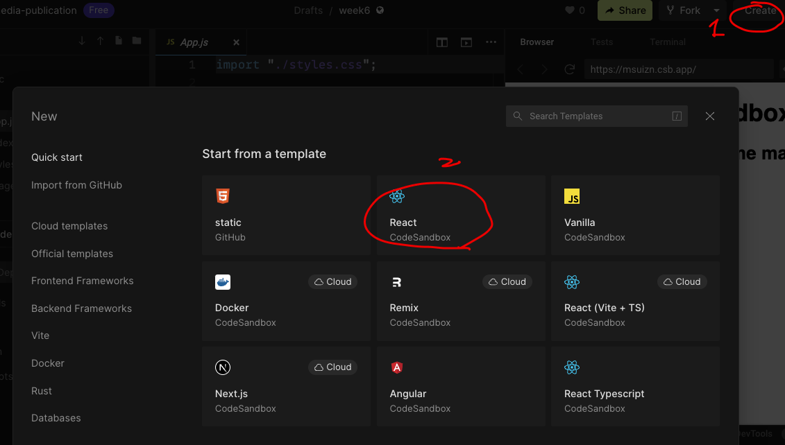

```{r setup, include=FALSE}
knitr::opts_chunk$set(echo = TRUE)
```

# VScode and Node.js

-   Node.js: a runtime built on Javascript language for modern web world

-   VScode (Visual Studio Code): an IDE for general usage. You can use it for any computer language if your set up properly.

## Project

In RStudio, a folder is considered a project if it consists of an `.Rproj` file which defines project structure. As in RStudio, VScode considers a folder as a project if it consists of an `package.json` file.

> Actually VScode calls it a **package** instead of a project. In R, package is a special type of project. However, in a general interpretation project and package are the same thing.

## Codesandbox

The platform emulates VScode in the cloud. Every template is to create a project. Therefore, the root normally consists of a `package.json` file.

-    [package.json example](https://codesandbox.io/s/week6-msuizn?file=/package.json)

## package.json

-   `"main"`: define the main program file. (The program to be executed for the app to start.)

-   `"dependencies"`: packages needed for the app to work.

-   `"devDependencies"`: packages the developer of the current project also used, only for the convenience of development, but have no impact on how package functions.

In RStudio we can use `install.packages`, `remotes::install_github` , etc. to download a package and install it. In VScode, **download** and **installation** are two separate steps.

## Install a package

In VScode,

1.  After you download a package, you need to use **Open Folder ...** to open the folder as a **package** (aka as a **project**).

2.   Run in **Terminal\
    **`npm i` \
    where `npm` stands for Node.js project manager, and `i` means installation. This will install all packages listed in `"dependencies"` and `"devDependencies"`.

> That is another reason why you need to install Node.js.

## Example: week 5 project

-   [week 5 project](https://codesandbox.io/s/week5-s563u2)

# React App

## Codesandbox template

{width="600"}

\##
