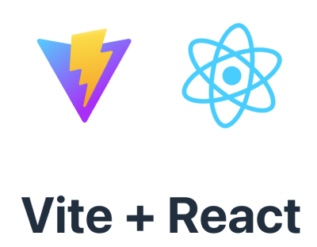

# Initiate a React npm project

  * learn how to create a React project with Vite development enhancing environment


## Vite to create React projects 


  1. Open project in your vscode. 
  2. In vscode terminal, type:  
```
npm create vite@latest week8App -- --template react
```

It will create a `week8App/` folder under your project folder, which by itself is a project. The project is

  * A React-Vite project , with
  * a vite development environment.

After creation, it also said: Now run

```
  cd week8App
  npm install
  npm run dev
```

  * line 1: change terminal directory to `week8App/`.

  * line 2: install the project dependencies

  * line 3: run the developing result.

You should see



Now we will use that project as a template to develop our own project.


## .js and .jsx

JS that has jsx element should have an extension `.jsx`. However, use `.js` will work. But in a strict environment setting you must use `.jsx`.

## no index.jsx

When there is `main.jsx` it will be considered as a main program that corresponds to the "main" setting in **package.json**. But use `main.jsx` let you skip that setting in **package.json**.

# Design components

In the past, we design component (as a jsx function) inside `App.jsx`. However, components should be saved in separate `.jsx` files and using folders to carefully categorize them. That is a modulization concept. 

If you follow our class closely, your React project will end up like:

  * [week8-vite-react](https://github.com/tpemartin/111-2-multimedia-publication/tree/main/week8-vite-react)


## Layout folder


### File structures:

  * img/
  * index.jsx
  * index.css

### Figma

  * <https://www.figma.com/file/lMbFHBKni09R2YdpZMNR2T/week8?t=sa7L2ShHXh0pyc7y-6>

### CSS adjustment

Paste Figma CSS to `Layout/index.css`. However, move `.App`  css to `App.css`

Thare some modifications:

  * App.css: [#root](https://github.com/tpemartin/111-2-multimedia-publication/blob/2544f956074002e4a61b054bd0da314bfe9e9b28/week8-vite-react/src/App.css#L1), [.App](https://github.com/tpemartin/111-2-multimedia-publication/blob/2544f956074002e4a61b054bd0da314bfe9e9b28/week8-vite-react/src/App.css#L48)

  * index.css: [.navbar](https://github.com/tpemartin/111-2-multimedia-publication/blob/2544f956074002e4a61b054bd0da314bfe9e9b28/week8-vite-react/src/components/Layout/index.css#L23) [.main](https://github.com/tpemartin/111-2-multimedia-publication/blob/68e396d4cf390cf60c9ba173b34bc6be7335ae0f/week8-vite-react/src/components/Layout/index.css#L2) 

### file path

In web file system, `.` means:

  * starting from the folder of the file who uses `.` to look for `index.jsx`, if it is there that is consider the root folder. If not, go one folder up to look for `index.jsx`, if not continue to look for at one folder up until you see one `index.jsx`. The folder of the first `index.jsx` you see is the root folder for that file who uses `.`


### export function

If your components are to be used in other `.jsx` file, you need to add `export` to the front of `function`. 

If only one component is for cross-jsx use, you can put `export default` instead.

### import css and image

```
import './index.css'
import play from './img/play.svg'
import next from './img/next.svg'
import previous from  "./img/previous.svg"
```

### no-jsx js expression

jsx refers to those `<Component>`. If you need to use non-jsx/js expression **WITHIN** the jsx syntax, like a name call to a js object. You need to surround it by `{...}`.


# Material Design UI (MUI)

## [MUI installation](https://mui.com/material-ui/getting-started/installation/)

```
npm install @mui/material @emotion/react @emotion/styled
```

## Buttons component

### Usage of MUI

  * [Basic buttons](https://mui.com/material-ui/react-button/)

The usage is divided into two parts:

  * import the component.
  * write its jsx element code.

For example, suppose we want to use `<BottomNavigation>`, `<BottomNavigationAction>` elements as
```
<BottomNavigation showLabels>
            <BottomNavigationAction label="Recents" icon={<RestoreIcon />} />
            <BottomNavigationAction label="Favorites" icon={<FavoriteIcon />} />
            <BottomNavigationAction label="Nearby" icon={<LocationOnIcon />} />
        </BottomNavigation>

```


## Navbar component

Suppose we want to create a `<Navbar>` jsx component that looks like:

  * [Bottom Navigation](https://mui.com/material-ui/react-bottom-navigation/#bottom-navigation)

  * Under somewhere in your `src/` folder create a `Navbar/` folder.
  * Inside `Navbar/` folder create a `index.jsx` file.

# Reference

  * [React Installation](https://react.dev/learn/installation)

  * [Add React to existing project](https://react.dev/learn/add-react-to-an-existing-project#using-react-for-a-part-of-your-existing-page)
  * [Scaffolding your first Vite project](https://vitejs.dev/guide/#scaffolding-your-first-vite-project)

