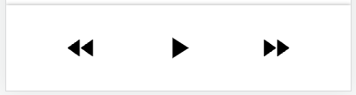

# Component props and children

Component function:
```
export function Component1(){

}
```

  * Used as
  ```
  <Component1/>
  ```

Component function:
```
export function Component2({children}){
  return (
   <div ...>
      :
      {children}
   </div>

  )
}
```

  * Used as
  ```
  <Component2>
    <Other Component/>
  </Component2>
  ```

Component function:
```
export function Component3({arg1, arg2, children}){
  return (
   <div ...>
      :
      {children}
   </div>

  )
}
```

  * Used as
  ```
  <Component3 arg1=...  arg2=...>
  :
    <Other Component/>
  </Component3>
  ```

## Custom Navbar

  * Build a footer navigation bar that allows developers to put in arbitrary icons.
  * learn how to import icons from Material UI (MUI)
  
### current


```
<Navbar/>
```



### custom

```
import PlayIcon from '@mui/icons-material/PlayArrow';
import NextIcon from '@mui/icons-material/FastForward';
import PreviousIcon from '@mui/icons-material/FastRewind';

<NavbarCustom>
    <NavbarItem>
        <PreviousIcon/>
    </NavbarItem>
    <NavbarItem>
        <PlayIcon/>
    </NavbarItem>
    <NavbarItem>
        <NextIcon/>
    </NavbarItem>
</NavbarCustom>
```

  * Icons are imported from MUI. Developers can put in their own design as well.

### MUI icons

  * Install MUI
  
  ```
  npm install @mui/material @emotion/react @emotion/styled
  ```
  


  * <https://mui.com/material-ui/material-icons/>


# Card

## Stamp

  * <https://codepen.io/orhanveli/pen/nEVqvv>

  * [mui-image](https://mui-image.surge.sh/)
  
  * [SVG filter](https://dev.to/photostockedit1/change-color-of-svgs-images-with-css-filter-53h5)

# Rendering lists

  * <https://react.dev/learn#rendering-lists>

## Array 

Similar to R list without element names. Usage:

```
arrayExample = [v1, v2, v3]
```
  
  * element values `(v1, v2, v3)` do NOT have to be of the same type/class.

```
const products = [
  { title: 'Cabbage', id: 1 },
  { title: 'Garlic', id: 2 },
  { title: 'Apple', id: 3 },
];
```

## Object

Similar to R list with element names.
```
objectExample = { title: 'Cabbage', id: 1 }
```

  * used to described SINGLE observation.
  * All element values must have names.


# Material Design UI (MUI)

## [MUI installation](https://mui.com/material-ui/getting-started/installation/)

```
npm install @mui/material @emotion/react @emotion/styled
```

## Buttons component

### Usage of MUI

  * [Basic buttons](https://mui.com/material-ui/react-button/)

The usage is divided into two parts:

  * import the component.
  * write its jsx element code.

For example, suppose we want to use `<BottomNavigation>`, `<BottomNavigationAction>` elements as
```
<BottomNavigation showLabels>
            <BottomNavigationAction label="Recents" icon={<RestoreIcon />} />
            <BottomNavigationAction label="Favorites" icon={<FavoriteIcon />} />
            <BottomNavigationAction label="Nearby" icon={<LocationOnIcon />} />
        </BottomNavigation>

```


## Navbar component

Suppose we want to create a `<Navbar>` jsx component that looks like:

  * [Bottom Navigation](https://mui.com/material-ui/react-bottom-navigation/#bottom-navigation)

  * Under somewhere in your `src/` folder create a `Navbar/` folder.
  * Inside `Navbar/` folder create a `index.jsx` file.
